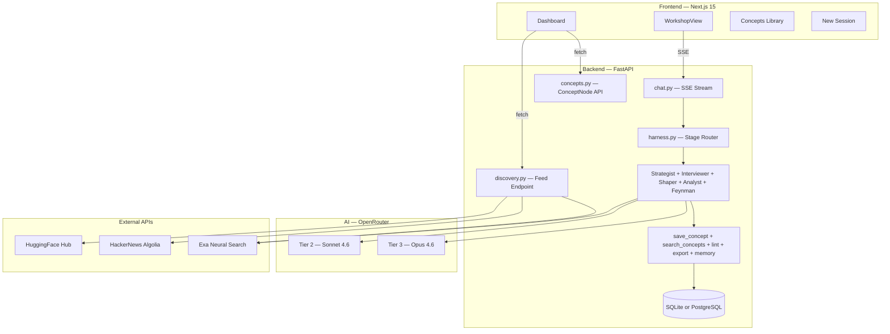
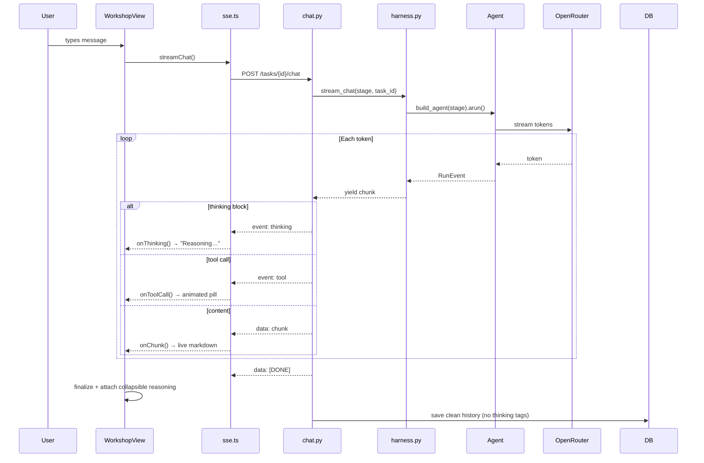

# BroCoDDE

**Personal Knowledge Engine — Content Discovery & Micro-Learning Studio**
*Version 0.4 — Prabakaran Chandran / Pracha Labs*

> Learn deeply. Surface what matters. Build a knowledge graph that compounds.

---

## What It Is

BroCoDDE is a **personal knowledge engine** — an agentic workspace for two distinct modes of intellectual work:

**Spark Mode** — Feynman-technique micro-learning sessions. You explain a paper or concept to the agent. It probes your understanding Socratically. The session ends when you choose — by saying "let's save this." The agent crystallizes your insight into a ConceptNode and, optionally, a tight written synthesis. No forced pipeline. The act of explaining *is* the learning.

**Deep Mode** — A structured 5-stage content development pipeline for building substantial written syntheses — long-form posts, essays, or technical explainers — guided by specialized AI agents at each stage.

The fundamental unit in both modes is the **CoDDE-task** (e.g., `codde-20260228-001`) — a persistent, uniquely-identified session that carries its own context, memory, chat history, drafts, lint results, and reflection across its full lifecycle. Nothing is a one-shot prompt. Everything accumulates.

What separates this from a chat tool: **compounding knowledge**. Every Spark session adds a ConceptNode to your personal knowledge graph. Every Deep session builds on that graph. The more you use it, the richer the Discovery feed becomes. The agent knows what you've already explored.

---

## The Two Session Modes

### Spark Mode — Feynman Learning Loop

```
[ feynman → ready ]
```

Drop a paper URL, paste an arxiv link, or just start explaining a concept raw. The Feynman agent:

- Fetches and reads the source (if URL provided)
- Opens: *"Explain this to me as you understand it."*
- Probes gaps through questions — never corrections, never corrections before understanding
- Surfaces connections to your prior ConceptNodes only when overlap is unmistakable
- When you signal done: auto-saves a ConceptNode (title + core insight + domain + tags) and generates a tight micro-synthesis (150-200 words)

**Exit is user-driven.** The agent never auto-advances. You say "let's save this" or "let's publish this" — the agent responds.

### Deep Mode — Synthesis Pipeline

```
Discovery → Extraction → Drafting → Vetting → Ready → Post-Mortem
```

Five stages, five agent contexts, one continuous memory session. Each stage transition carries full chat history forward. The agent knows what you discussed in Discovery when it's helping you vet the draft.

| Stage | Agent | What Happens |
|---|---|---|
| **Discovery** | Strategist | Scans memory + compute_patterns + HF daily papers → presents 3 specific angles worth exploring |
| **Extraction** | Interviewer | Role-based structured interview — pulls the insight out of you, one question at a time |
| **Drafting** | Shaper | Skeleton → draft in one continuous pass. Ask for feedback on specific choices. |
| **Vetting** | Shaper | Paste full draft → 6-check lint: opening strength, micro-learning, credential-stating, rant detection, fluff, engagement bait |
| **Ready** | Shaper | Final synthesis. Export, format, share. |
| **Post-Mortem** | Analyst | Reflect on the session. What resonated and why. Patterns logged to memory. |

---

## The Compounding Knowledge Graph

Every Spark session auto-saves a **ConceptNode** to your personal knowledge graph:

```python
ConceptNode {
    title:        "Diffusion models as energy-based models"
    core_insight: "1-sentence crystallized insight"
    source_url:   "https://arxiv.org/abs/..."
    domain:       "Generative Models"
    tags:         ["diffusion", "energy-based", "score-matching"]
    connections:  [concept_id_1, concept_id_2]  # lazy links
    task_id:      "codde-20260304-007"
}
```

The Feynman agent queries these before every session via `search_concepts_tool`. It surfaces prior concepts only when the connection is unmistakable — not aggressively cross-domain fishing. The `/concepts` page shows your full concept library with source links, domain tags, and session links.

The Discovery feed on the dashboard uses your top domains (from task history) to personalize HF papers, HN discussions, and Exa niche perspectives — so the "what to explore next" surface improves automatically as your graph grows.

---

## Personalized Discovery Feed

The dashboard surfaces a live feed of things worth exploring — three interleaved sources, personalized by your domain history:

| Source | Signal | Filter |
|---|---|---|
| **HuggingFace** | Today's daily papers, sorted by upvotes | >10 upvotes gate (fallback: top-N by upvotes) |
| **HackerNews** | Recent stories on your top domains | `search_by_date` — no points floor |
| **Exa** | Niche perspectives — substacks, blogs, underrated research | Gwern, LessWrong, Lilian Weng, Interconnects, Simonwillison, etc. |

Each card has:
- Type badge (paper / discussion / perspective)
- Title + summary
- Upvote count
- **⚡ Spark** — one click creates a Spark session with the URL pre-filled

---

## Architecture



---

## Streaming Data Flow



---

## The Five Agents

| Agent | Mode / Stage | Model | Key Capability |
|---|---|---|---|
| **Strategist** | Deep / discovery | Tier 3 | ContentDiscoveryToolkit (6 signals) + compute_patterns + memory → 3-angle brief |
| **Interviewer** | Deep / extraction | Tier 2 | 12 role-based interview modes; web_search for real-time fact grounding |
| **Shaper** | Deep / drafting · vetting · ready | Tier 2-3 | Skeleton + draft in one pass; lint_draft (6 checks); format_for_platform |
| **Analyst** | Deep / post-mortem | Tier 3 | compute_patterns; retrospective insight; memory writes for future sessions |
| **Feynman** | Spark / feynman | Tier 3 | Socratic probing; web_fetch source URL; save_concept_tool; search_concepts_tool |

**Shared across all agents:** MemoryTools, web_search_tool, web_fetch_tool, skill_load

### Proactive Behaviors

**`[AUTO_OPEN]`** — Fresh Deep task with no history: Strategist opens without user input. Scans memory, runs compute_patterns, fetches today's HF papers, presents 3 angles. Invisible to user.

**`[AUTO_SPARK]`** — Fresh Spark task: Feynman reads the source URL (if provided), then asks the user to explain. Invisible to user.

**`[ADVANCE_STAGE]`** — Agent appends this when it determines the user is ready to move forward. Frontend auto-advances lifecycle — no button click, no API call.

**`[TITLE: ...]`** — Agent infers a task title from context and embeds it in early messages. Frontend extracts and saves it silently.

---

## Memory Architecture

Session memory anchors to `task_id` — not the stage. Every agent in every stage of the same task shares one continuous Agno session. Stage transitions don't break memory context.

```
6-Layer Memory Stack
────────────────────────────────────────
Identity       Background · experience · credentials
Knowledge      Domains · concepts · frameworks
Content        Past tasks · drafts · patterns
Voice          Style · tone · structural preferences
Goals          Learning targets · growth intent
Session        Active task context (ephemeral)
────────────────────────────────────────

Memory lifecycle (all agents follow this):
  Before first message  → retrieve relevant past
  Every 2-3 turns       → write when insight surfaces
  When user refines     → update existing entry (never duplicate)
```

Agno's `agno_memories` table stores auto-written entries. The `/context` page shows these in a timeline view with topic filters and an "evolved" badge for entries meaningfully updated after creation.

---

## Skills System

13 on-demand skill modules in `backend/app/skills/`. Each is a `SKILL.md` reference document loaded at agent call time via `skill_load(skill_name)`. No vector embeddings — agent context determines which skill to pull.

| Module | Purpose |
|---|---|
| `content-discovery` | Discovery signals, trending topic frameworks |
| `content-extraction` | Interview playbooks by role (12 roles) |
| `structuring` | Narrative architecture, skeleton archetypes |
| `drafting` | Draft development patterns, voice preservation |
| `vetting` | Lint rules, 6-check quality framework |
| `grammar-style` | Style guide, punctuation, rhythm |
| `linkedin` | LinkedIn formatting and engagement mechanics |
| `twitter` | Twitter/X thread construction |
| `voice` | Creator voice preservation techniques |
| `memory` | Memory tagging and retrieval patterns |
| `analytics` | Post-mortem analysis frameworks |
| `series` | Content series architecture and sequencing |
| `agno-architecture` | Agno agent patterns and tool usage |

---

## Model Tiers

All AI calls route through **OpenRouter** — a single endpoint for all models.

| Tier | Default Model | Used For |
|---|---|---|
| Tier 1 | `deepseek/deepseek-chat:free` | Utility tasks, memory writes, grammar checks |
| Tier 2 | `anthropic/claude-sonnet-4.6` | Extraction, drafting, vetting — the daily workhorses |
| Tier 3 | `openrouter/auto` | Discovery briefs, Feynman sessions, post-mortems |

All tiers overridable: `TIER1_MODEL`, `TIER2_MODEL`, `TIER3_MODEL` in `.env`.

---

## Data Model

```python
# Core session unit
CoddeTask {
    id:            "codde-20260304-007"
    task_type:     "deep" | "spark"
    stage:         "discovery" | "extraction" | "drafting" | "vetting" |
                   "ready" | "post-mortem" | "feynman"
    source_url:    "https://arxiv.org/..."      # Spark: paper/article URL
    role:          "researcher" | "teacher" | ...  # Deep: 12 roles
    intent:        "teach" | "connect" | ...       # Deep: 6 intents
    domain:        "Machine Learning"
    chat_history:  [...]                        # Full conversation
    skeleton:      { hook, insight, key_points, landing }
    lint_results:  { opening_strength, micro_learning, ... }
    final_content: "..."
}

# Knowledge graph node (auto-saved by Feynman agent)
ConceptNode {
    id, title, core_insight, source_url, source_title,
    domain, tags, connections, task_id, created_at
}

# Identity memory (manually curated)
MemoryEntry { type: Experience|Research|Philosophy|Voice|Goal|Current }

# Auto-written agent memory (Agno-managed)
AgnoMemory { text, topics, created_at, updated_at }
```

**Persistence guarantees:**
- Startup: DB auto-backed-up to `backend/backups/brocodde.YYYYMMDD.bak.db` (7-day retention)
- `create_all()` is additive-only — never drops tables or columns
- Column migrations: `_sqlite_add_column_if_missing()` guards in `database.py`
- Production: swap `DATABASE_URL` to a PostgreSQL connection string — no code changes

---

## Tech Stack

| Layer | Technology |
|---|---|
| Backend | Python 3.12 · FastAPI · Uvicorn (async) |
| Agent Framework | Agno AgentOS (MemoryManager · MemoryTools · Toolkit) |
| AI Gateway | OpenRouter (Claude Sonnet/Opus · Gemini · DeepSeek) |
| Neural Search | Exa API (ContentDiscoveryToolkit + Discovery Feed) |
| Paper Discovery | HuggingFace Hub (`list_daily_papers`, `list_papers`) |
| Database | SQLAlchemy async · SQLite (dev) · PostgreSQL (prod) |
| Frontend | Next.js 15 · React 19 · TypeScript · Tailwind CSS |
| Streaming | Server-Sent Events (SSE) — `event: thinking`, `event: tool`, `event: advance` |

---

## Project Structure

```
broCoDDE/
├── backend/
│   ├── app/
│   │   ├── agents/
│   │   │   ├── harness.py                  ← Stage → agent router + SSE orchestrator
│   │   │   ├── base.py                     ← UNIVERSAL_SYSTEM_PROMPT (all agents)
│   │   │   ├── strategist.py               ← Discovery (Tier 3)
│   │   │   ├── interviewer.py              ← Extraction (Tier 2)
│   │   │   ├── shaper.py                   ← Drafting / Vetting / Ready (Tier 2-3)
│   │   │   ├── analyst.py                  ← Post-mortem (Tier 3)
│   │   │   ├── feynman.py                  ← Spark learning loop (Tier 3)
│   │   │   ├── tools.py                    ← lint_draft · export · save_concept · search_concepts
│   │   │   └── content_discovery_toolkit.py ← 6-signal discovery (HF · HN · Exa ×3)
│   │   ├── routes/
│   │   │   ├── chat.py                     ← SSE route · thinking tag parser · AUTO_SPARK
│   │   │   ├── tasks.py                    ← CoDDE-task CRUD (task_type, source_url)
│   │   │   ├── concepts.py                 ← ConceptNode CRUD
│   │   │   └── discovery.py                ← /discovery/feed (HF + HN + Exa)
│   │   ├── skills/                         ← 13 SKILL.md modules
│   │   ├── memory/store.py                 ← Memory retrieval, compute_patterns
│   │   ├── models/router.py                ← Tier 1/2/3 OpenRouter routing
│   │   ├── db/
│   │   │   ├── database.py                 ← Engine · startup backup · additive migrations
│   │   │   └── models.py                   ← CoddeTask · ConceptNode · Series · MemoryEntry · ...
│   │   └── config.py                       ← Pydantic settings + env validation
│   └── tests/
└── frontend/
    ├── app/
    │   ├── page.tsx                        ← Dashboard: feed + active sessions + stats
    │   ├── workshop/
    │   │   ├── new/page.tsx                ← New session: Deep/Spark toggle + ?url= param
    │   │   └── [id]/page.tsx               ← Workshop: lifecycle bar + agent chat
    │   ├── concepts/page.tsx               ← Concept library (knowledge graph view)
    │   ├── queue/page.tsx                  ← Sessions list
    │   ├── context/page.tsx                ← Identity memory + agent memory + domains
    │   ├── series/page.tsx                 ← Content series management
    │   └── observatory/page.tsx            ← Aggregate analytics
    ├── components/
    │   ├── layout/Sidebar.tsx              ← Nav + recent sessions + Concepts link
    │   └── workshop/
    │       ├── WorkshopView.tsx            ← Chat UI · SSE consumer · AUTO_SPARK/AUTO_OPEN
    │       └── LifecycleBar.tsx            ← Stage bar (LIFECYCLE_STAGES / SPARK_STAGES)
    └── lib/
        ├── api.ts                          ← REST client (tasks · concepts · series · memory)
        ├── sse.ts                          ← SSE client (thinking · tool · advance events)
        └── types.ts                        ← TypeScript types (LifecycleStage · ConceptNode · ...)
```

---

## Quickstart

```bash
# 1. Clone
git clone https://github.com/prabakaranc98/broCoDDE
cd broCoDDE

# 2. Configure
cp backend/.env.example backend/.env
# Add: OPENROUTER_API_KEY, EXA_API_KEY (optional: HF_TOKEN)

# 3. Start (kills :8000 and :3000, starts both with nohup)
./start.sh

# 4. Open
open http://localhost:3000
```

**Manual start:**

```bash
# Backend
cd backend
pip install uv && uv pip install -e ".[dev]"
uvicorn app.main:app --reload --port 8000

# Frontend
cd frontend && npm install && npm run dev
```

**Tests:**

```bash
cd backend && pytest tests/ -v
```

---

## Environment Variables

```bash
# Required
OPENROUTER_API_KEY=sk-or-v1-...

# Optional — enables richer discovery
EXA_API_KEY=exa_...          # Exa niche perspectives in feed + ContentDiscoveryToolkit
HF_TOKEN=hf_...              # Authenticated HF Hub access (higher rate limits)

# Model overrides
TIER1_MODEL=deepseek/deepseek-chat:free
TIER2_MODEL=anthropic/claude-sonnet-4.6
TIER3_MODEL=openrouter/auto

# Application
DATABASE_URL=sqlite+aiosqlite:///./brocodde.db   # or postgresql+asyncpg://...
CORS_ORIGINS=["http://localhost:3000"]
ENVIRONMENT=development

# Frontend
NEXT_PUBLIC_API_URL=http://localhost:8000
```

---

## What Gets Better Over Time

| As you use it | What improves |
|---|---|
| More Spark sessions | ConceptNode graph grows → Feynman agent finds richer connections |
| More Deep sessions | compute_patterns has more signal → Discovery briefs get more specific |
| More domains explored | Discovery feed personalizes more precisely to your intellectual territory |
| More memory entries | Agent knows your voice, preferences, and past work without being told |
| More post-mortems | Analyst patterns sharpen → future Strategist briefs reflect what actually worked |

The design principle: **every session makes the next one cheaper to start and richer to execute.**

---

*BroCoDDE — Because understanding compounds.*
