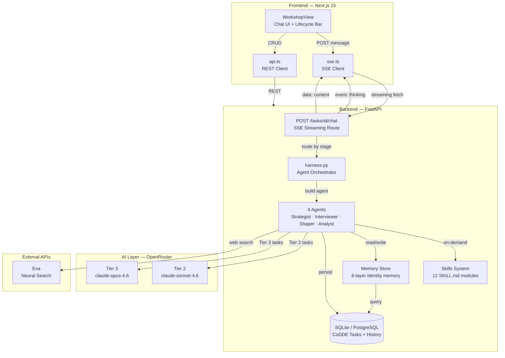
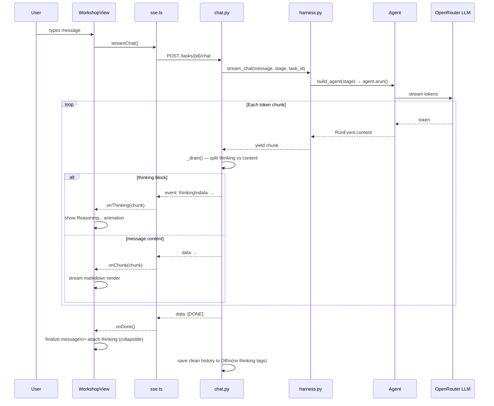
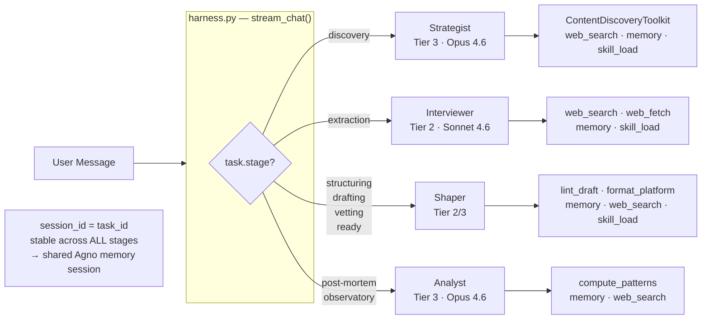
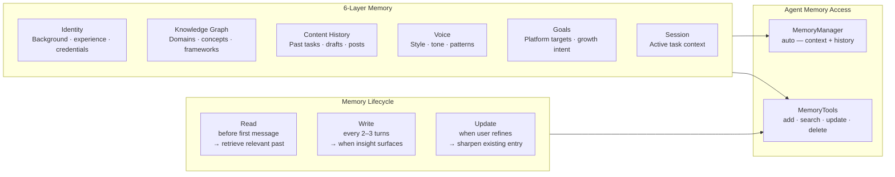

# BroCoDDE

**An IDE for Content Discovery, Development & Enablement**
*Version 0.4 — Prabakaran Chandran / Pracha Labs*

> The human builds. The IDE enables. Every CoDDE-task makes both smarter.

---

## What It Is

BroCoDDE is a **Content Development Life Cycle (CoDLC) engine** — an opinionated, agentic workspace that guides content from raw idea to published post through seven structured lifecycle stages.

The fundamental unit of work is the **CoDDE-task** — a uniquely identified content development cycle (e.g. `codde-20260228-001`) that carries its own context, memory, chat history, drafts, lint results, and post-mortem analysis across its entire lifetime. Nothing is a one-shot prompt. Everything accumulates.

**Seven lifecycle stages:**

```
Discovery → Extraction → Structuring → Drafting → Vetting → Ready → Post-Mortem
```

Each stage activates a different specialized agent. The agent switches, but the memory, context, and conversation history carry forward — the task never loses its thread.

---

## Overall Architecture



---

## Streaming Data Flow



---

## Agent Stage Routing



---

## Memory Architecture



---

## Agentic Design

### The Harness Pattern

The `harness.py` is the single routing function — the orchestrator for all agent interactions. The Workshop chat interface makes one call: `stream_chat(message, stage, task_id)`. The harness resolves the stage, builds the correct agent, and streams back.

```
User message
     │
     ▼
harness.stream_chat(message, stage, task_id)
     │
     ├── resolves: STAGE_AGENT_MAP[stage] → agent_name
     ├── builds:   agent = build_strategist | build_interviewer | build_shaper | build_analyst
     ├── passes:   session_id = task_id  ← stable across ALL stage transitions
     │
     ▼
agent.arun(message, stream=True)
     │
     ▼
SSE chunks → chat.py → frontend
```

**The `session_id = task_id` invariant** is critical. Agno uses session_id to scope memory. If it changes on stage transition, the agent loses all prior turns. Anchoring to `task_id` means every agent in every stage shares a single continuous session.

### UNIVERSAL_SYSTEM_PROMPT

Every agent receives the same base behavioral layer (`base.py`). Six directives govern **how** agents communicate — role-specific instructions handle the **what**.

| Directive | Rule |
|---|---|
| Conversational Presence | Match user energy. No AI filler. Validate before pivoting. |
| Output Structure | Lead with insight. Match format to complexity. Bold sparingly. |
| Storytelling Spine | Hook → Core → Support → Landing. Never leave without a next step. |
| Sludge Reduction | One question per turn. No methodology narration. No buried answers. |
| Nudge Language | Micro-celebrations, progress signals, binary choices. |
| Aesthetics | 1-3 sentence paragraphs. Em dashes. Pristine markdown. |

### Thinking / Reasoning Display

When Tier 3 models (Opus 4.6) emit reasoning tokens (`<thinking>...</thinking>` blocks), the backend separates them from the response content before streaming:

- Reasoning → `event: thinking` SSE frames → frontend "Reasoning…" animation
- Response → default `data:` SSE frames → markdown render

After the response completes, a **"Show reasoning"** toggle appears on the message — collapsed by default, expandable on click. Thinking is never saved to chat history (it's ephemeral reasoning, not content).

### Stage Transitions — `[ADVANCE_STAGE]`

When the user explicitly agrees to move forward, the agent appends `[ADVANCE_STAGE]` at the end of its response. The frontend detects this in the SSE stream and auto-advances the lifecycle stage — no separate API call, no button click required.

### Proactive Opening — `[AUTO_OPEN]`

When a fresh CoDDE-task loads with empty chat history, the frontend sends an `[AUTO_OPEN]` trigger. The Strategist opens without user input — scans memory, runs `compute_patterns`, fetches today's HuggingFace daily papers, presents 3 content angles. The trigger is invisible to users and filtered from chat history.

---

## The Four Agents

| Agent | Stages | Model | Key Tools |
|---|---|---|---|
| **Strategist** | discovery | Tier 3 · Opus 4.6 | ContentDiscoveryToolkit (6 signals), compute_patterns, web_search, memory |
| **Interviewer** | extraction | Tier 2 · Sonnet 4.6 | web_search, web_fetch, memory, skill_load (role-based extraction) |
| **Shaper** | structuring · drafting · vetting · ready | Tier 2/3 | lint_draft, format_for_platform, web_search, memory, skill_load |
| **Analyst** | post-mortem · observatory | Tier 3 · Opus 4.6 | compute_patterns, memory, web_search |

**ContentDiscoveryToolkit** (6 discovery signal sources):

| Tool | Source |
|---|---|
| `get_hf_daily_papers` | HuggingFace daily papers |
| `search_hf_papers` | HuggingFace paper search |
| `get_hackernews_stories` | HackerNews Algolia |
| `search_exa_news` | Exa news search |
| `search_exa_research` | Exa academic research |
| `search_exa_underrated` | Exa underrated/niche content |

---

## Model Tier Routing

All AI calls route through **OpenRouter** — a single endpoint for all models.

| Tier | Model | Use Cases |
|---|---|---|
| **Tier 1** | `anthropic/claude-sonnet-4.6` | Grammar checks, memory writes, utility tasks |
| **Tier 2** | `anthropic/claude-sonnet-4.6` | Extraction, structuring, drafting — majority of work |
| **Tier 3** | `anthropic/claude-opus-4.6` | Discovery briefs, deep critique, post-mortem analysis |

All tiers override-able via `.env`: `TIER1_MODEL`, `TIER2_MODEL`, `TIER3_MODEL`.

---

## Skills System

12 skill modules in `backend/app/skills/` — each with a `SKILL.md` knowledge document. Loaded on-demand via `skill_load(skill_name)` tool call. No vector embeddings — agent context determines which skill to load.

| Module | Purpose |
|---|---|
| `content-discovery` | Discovery signals and trending topic frameworks |
| `content-extraction` | Interview playbooks by role (Researcher, Teacher, etc.) |
| `structuring` | Narrative architecture, skeleton templates |
| `drafting` | Draft development patterns |
| `vetting` | Lint rules, platform quality checks |
| `grammar-style` | Style guide, punctuation, rhythm rules |
| `linkedin` | LinkedIn-specific formatting and engagement patterns |
| `twitter` | Twitter/X thread construction |
| `voice` | Creator voice preservation techniques |
| `memory` | Memory tagging and retrieval patterns |
| `analytics` | Post-mortem analysis frameworks |
| `series` | Series architecture and content sequencing |

---

## Data Persistence

**Startup backup** — at Python module import time, `_backup_db_on_startup()` copies the DB to `backend/backups/brocodde.YYYYMMDD.bak.db`. 7-day retention. Safe to run on every restart.

**Additive-only migrations** — `create_all()` never drops tables. `_sqlite_add_column_if_missing()` adds new columns without touching existing data.

**Production** — swap `DATABASE_URL` in `.env` to a PostgreSQL connection string. No code changes.

---

## Tech Stack

| Layer | Technology |
|---|---|
| Backend | Python 3.12 · FastAPI · Uvicorn (async) |
| Agent Framework | Agno AgentOS (MemoryManager · MemoryTools · Toolkit) |
| AI Gateway | OpenRouter (Claude · Gemini · GPT) |
| Search | Exa API (ContentDiscoveryToolkit) |
| Database | SQLAlchemy async · SQLite (dev) · PostgreSQL (prod) |
| Frontend | Next.js 15 · React 19 · TypeScript · Tailwind CSS |
| Streaming | Server-Sent Events (SSE) |

---

## Project Structure

```
broCoDDE/
├── backend/
│   ├── app/
│   │   ├── agents/
│   │   │   ├── harness.py          ← STAGE ROUTER — the orchestrator
│   │   │   ├── base.py             ← UNIVERSAL_SYSTEM_PROMPT (all agents)
│   │   │   ├── strategist.py       ← Discovery agent (Tier 3)
│   │   │   ├── interviewer.py      ← Extraction agent (Tier 2)
│   │   │   ├── shaper.py           ← Structuring / Drafting / Vetting (Tier 2-3)
│   │   │   └── analyst.py          ← Post-mortem / Observatory (Tier 3)
│   │   ├── skills/                 ← 12 SKILL.md modules (on-demand loading)
│   │   ├── memory/
│   │   │   └── store.py            ← Memory retrieval, performance patterns
│   │   ├── models/
│   │   │   └── router.py           ← Tier 1/2/3 routing via OpenRouter
│   │   ├── routes/
│   │   │   ├── chat.py             ← SSE route + thinking tag parser
│   │   │   └── tasks.py            ← CoDDE-task CRUD
│   │   ├── db/
│   │   │   ├── database.py         ← Engine, startup backup, additive migrations
│   │   │   └── models.py           ← SQLAlchemy ORM models
│   │   └── config.py               ← Pydantic settings with env validation
│   └── tests/
└── frontend/
    ├── app/                        ← Next.js routes
    ├── components/
    │   └── workshop/
    │       └── WorkshopView.tsx    ← Chat UI, SSE consumer, thinking UI
    └── lib/
        ├── api.ts                  ← REST client
        ├── sse.ts                  ← SSE client (event: thinking aware)
        └── types.ts                ← TypeScript types
```

---

## Quickstart

```bash
# 1. Clone and configure
git clone https://github.com/prabakaranc98/broCoDDE
cd broCoDDE
# Add OPENROUTER_API_KEY and EXA_API_KEY to backend/.env

# 2. Start everything (kills :8000 and :3000, starts both with nohup)
./start.sh

# 3. Open http://localhost:3000
```

**Manual start:**

```bash
# Backend
cd backend && pip install uv && uv pip install -e ".[dev]"
uvicorn app.main:app --reload --port 8000

# Frontend
cd frontend && npm install && npm run dev
```

**Tests:**

```bash
cd backend && pytest tests/ -v
```

---

## Environment Variables

```bash
# Required
OPENROUTER_API_KEY=sk-or-v1-...
EXA_API_KEY=...

# Model overrides (defaults shown)
TIER1_MODEL=anthropic/claude-sonnet-4.6
TIER2_MODEL=anthropic/claude-sonnet-4.6
TIER3_MODEL=anthropic/claude-opus-4.6

# Application
DATABASE_URL=sqlite+aiosqlite:///./brocodde.db
CORS_ORIGINS=["http://localhost:3000"]
ENVIRONMENT=development

# Frontend
NEXT_PUBLIC_API_URL=http://localhost:8000
```

---

## Views

| View | Route | Description |
|---|---|---|
| Dashboard | `/dashboard` | Weekly progress, active tasks, queue preview |
| Workshop | `/task/[id]` | CoDDE-task workspace — lifecycle bar + agent chat |
| Queue | `/queue` | Ready-to-publish drafts with lint badges |
| Observatory | `/observatory` | Aggregate performance analytics |
| Context | `/context` | Knowledge graph + identity memory |
| Series | `/series` | Content series management |

---

*Project BroCoDDE — Because the best content isn't created. It's engineered.*
